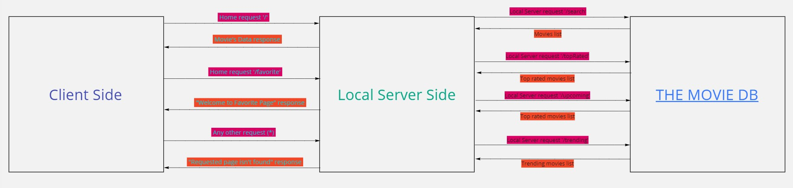
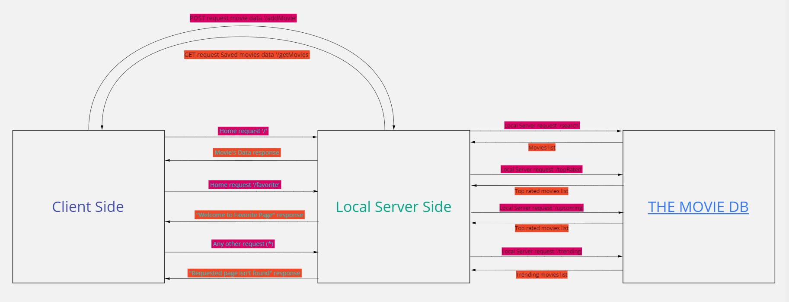
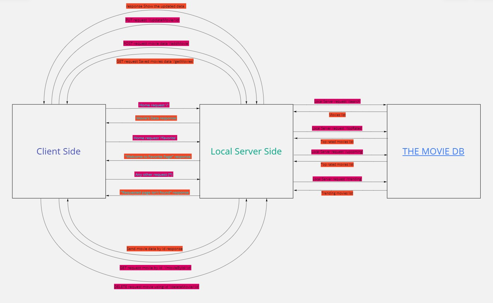

# Movies-Library - Version 1.0

**Author Name**: Osama Alzaghal.

## WRRC

## Overview 
LTUC Day 11 Task.

## Getting Started
- Clone this repo.
- Cd to repo local directory.
- npm init -y.
- npm install express cors.

## Project Features
- Includes serveral endpoints such as ('/', '/favorite' and '*' when you enter something wrong).

 

# Movies-Library - Version 2.0

## WRRC

## Getting Started
- Create an API Key.
- Install Axios to send an HTTP request to the API.
- Created .env file and add the API Key there.
- Installed dotenv library the configure it to make our server read the .env file.
- Created .env where I show the required variable for any developer will work on the same project.
- I created an error handler.
- I created a new end point that take the parameter from the URl where we found it inside req.query.
- Run the server by node server.js.
 

# Movies-Library - Version 3.0

## WRRC 

## Getting Started
- Install PostgreSQL.
- sqlstart to run the Postgres server.
- Create the databse.
- npm install pg.
- Create the database URL.
- Configurations for pg (require, new pg.Client, clint.connect).
- app.use(express.json()) to get into the body of request.
- Build the functions responsible of saving the object into the database and viewing it when requested.
 

# Movies-Library - Version 4.0

## WRRC 

## Getting Started
- Created functions to handle PUT,DELETE and GET requests.